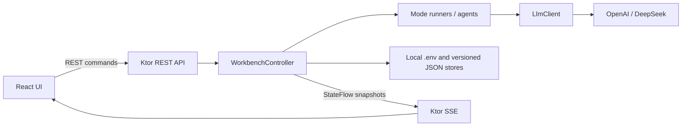
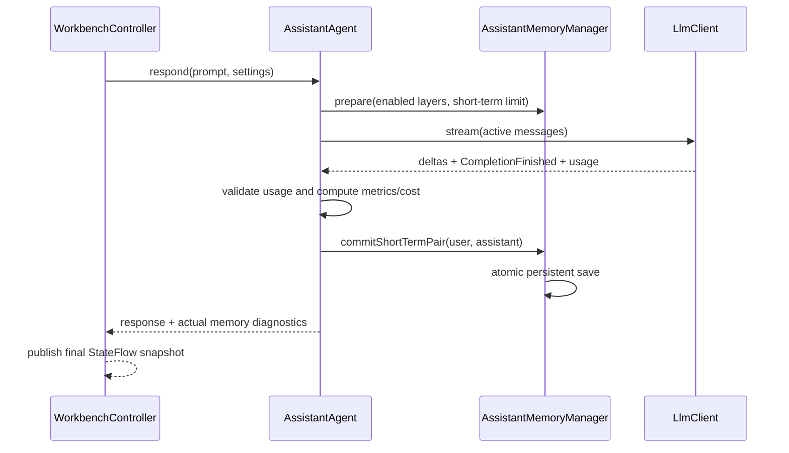

# Архитектура LLM Workbench

Этот документ — подробная карта проекта для разработки и сопровождения. Краткие обязательные правила для Codex находятся в корневом [AGENTS.md](../AGENTS.md), пользовательский запуск и описание функций — в [README.md](../README.md), точный HTTP-контракт — в [WEB_API.md](WEB_API.md).

## Назначение и границы

LLM Workbench — локальное web-приложение для диалогов с LLM, сравнения способов ответа и демонстрации управления токенами и контекстом. Один JVM-процесс:

- читает локальную конфигурацию и постоянное состояние;
- вызывает OpenAI или DeepSeek;
- управляет операциями, историей, памятью, метриками и стоимостью;
- отдаёт REST/SSE API и статическую production-сборку React.

Frontend не вызывает провайдеров напрямую. В проекте нет базы данных, учётных записей и отдельного Node.js backend. Node.js нужен для разработки и сборки frontend, но не для запуска готового distribution.

## Каталоги и ответственность

| Путь | Ответственность |
| --- | --- |
| `src/main/kotlin/llm` | Общий `LlmClient`, сообщения, completion events/options/usage, каталог моделей и фабрика провайдеров |
| `src/main/kotlin/llm/openai` | OpenAI-compatible transport и OpenAI-адаптер |
| `src/main/kotlin/llm/deepseek` | DeepSeek-адаптер |
| `src/main/kotlin/network` | Настройка общего Ktor `HttpClient`, таймаутов и retry |
| `src/main/kotlin/config` | Чтение и атомарное сохранение локального `.env` |
| `src/main/kotlin/tokens` | Оценка токенов, профили окон/цен, подготовка контекста, overflow и агрегаты |
| `src/main/kotlin/agent` | Обычный агент, старые контекстные стратегии, отдельный агент слоёв памяти и JSON stores |
| `src/main/kotlin/app` | Настройки, orchestration режимов, runners, `WorkbenchController` и UI-neutral state |
| `src/main/kotlin/web` | Явные DTO, валидация команд, REST/SSE, локальная защита и static resources |
| `frontend/src/api` | Зеркало wire-контракта и fetch-клиент |
| `frontend/src/state` | SSE-синхронизация, REST-команды и клиентская блокировка действий |
| `frontend/src/components` | Настройки, память, результаты и Markdown presentation |
| `src/test` | Unit/integration тесты и production-like deterministic web fixture |
| `frontend/tests` | Playwright-проверки настоящего Ktor API и React UI без платных запросов |
| `legacy-desktop` | Изолированное прежнее Compose-приложение |

## Запуск приложения

Production entry point — `src/main/kotlin/web/WebMain.kt` (`org.example.web.WebMainKt`). Он:

1. определяет loopback-порт из `WEB_PORT`, по умолчанию `8080`;
2. загружает `.env` через `LocalConfigStore` и нормализует настройки через `AppBootstrap`;
3. создаёт один общий HTTP-клиент;
4. собирает `WorkbenchController` с production stores и фабрикой `LlmClient`;
5. запускает Netty только на `127.0.0.1`;
6. при shutdown отменяет работу контроллера, закрывает HTTP-клиент и сервер.

`./gradlew runWeb` сначала собирает frontend: Gradle-задача `processResources` зависит от `frontendBuild`, а `frontend/dist` копируется в classpath `web`. `./gradlew :run` и `./llm` ведут к тому же web runtime.

Для разработки UI backend запускается с `WEB_DEV_PORT=5173`, а Vite отдельно через `npm --prefix frontend run dev`. Vite проксирует `/api`; произвольный CORS не включён.

`runWebFixture` использует `src/test/kotlin/web/WebFixture.kt`. Его fake clients детерминированы и доступны только в test source set, поэтому не могут случайно попасть в production distribution.

## Доменная orchestration

### Настройки и режимы

`AppSettings` хранит выбранный провайдер, модель, `ResponseMode`, лимиты ответа, историю, overflow policy, `ContextStrategy` и `recentMessagesLimit`. `LocalConfig` отображает эти значения в `.env`.

Текущие wire-id режимов определены в `ResponseMode.cliValue`:

| Режим UI | Enum / wire-id | Исполнитель |
| --- | --- | --- |
| Сравнение двух ответов | `COMPARE` / `compare` | `PromptRunner`, обе `ResponseVariant` |
| С ограничениями | `CONTROLLED` / `controlled` | `PromptRunner`, constrained prompt/options |
| Простой агент | `UNRESTRICTED` / `unrestricted` | `PromptRunner` или отдельный `AssistantAgent` для `MEMORY_LAYERS` |
| 4 способа рассуждения | `REASONING` / `reasoning` | `ReasoningRunner` |
| Сравнение температуры | `TEMPERATURE` / `temperature` | `TemperatureRunner` |
| Сравнение моделей | `MODEL_COMPARISON` / `models` | `ModelComparisonRunner` |
| Токены и контекст | `TOKENS_CONTEXT` / `tokens` | `TokenContextDemoRunner` |

«Простой агент» намеренно остаётся `UNRESTRICTED`/`unrestricted`. Стратегия памяти не является отдельным response mode.

### Центральный контроллер

`WorkbenchController` — граница между web/API и исполняющей логикой. Он владеет:

- текущим `WorkbenchState` в `MutableStateFlow`;
- API-ключами и выбранными моделями;
- единственной активной worker coroutine;
- `PromptRunner` для обычных вариантов и трёх старых context strategies;
- отдельными `AssistantMemoryManager` и `AssistantAgent`;
- специализированными runners экспериментов;
- монотонными номерами exchange/revision и streaming snapshots.

Все команды и worker transitions синхронизированы на контроллере. Одновременно разрешена одна операция. Настройки и мутации состояния во время неё отклоняются. `WorkbenchState` — серверный источник истины; React получает первоначальный снимок через REST, а последующие полные снимки через SSE.

При `UNRESTRICTED + MEMORY_LAYERS` контроллер направляет запрос прямо в `AssistantAgent`. Любой другой вариант `UNRESTRICTED` идёт через `PromptRunner` → `LlmAgent` → `ContextManager`. Эта развилка — главная граница, предотвращающая смешивание memory layers со старыми хранилищами.

### Обычный агент и история

`PromptRunner` владеет двумя `LlmAgent`: для `unrestricted` и `controlled`. Compare использует оба, одиночные режимы — соответствующий вариант. `ConversationHistoryStore` сохраняет обычную завершённую историю и token metrics в `.llm-history.json`.

Для unrestricted legacy history из старых форматов намеренно не повышается до состояния новых context strategies. Состояние `SLIDING_WINDOW`, `STICKY_FACTS` и `BRANCHING` хранится отдельно через `ContextStateStore` в `.llm-context-state.json`.

## Контекст Простого агента

### Старые стратегии в `ContextManager`

`ContextSessionState` содержит независимые поля для всех трёх старых стратегий. Их wire/state semantics нельзя незаметно переиспользовать для слоёв памяти.

| Стратегия | Активный контекст | Постоянное состояние |
| --- | --- | --- |
| `SLIDING_WINDOW` | system + последние N обычных сообщений с текущим user message | `slidingMessages` |
| `STICKY_FACTS` | system + извлечённые facts + последние N raw messages | `stickyFacts`, `stickyMessages`, `factUsage` |
| `BRANCHING` | system + immutable checkpoint prefix + suffix активной ветки + текущий user message | `branching.checkpoint`, `branches`, `activeBranchId` |

`STICKY_FACTS` делает отдельный LLM-вызов `FactExtractor`. Его usage является фактической стоимостью и сохраняется сразу, но кандидат facts/raw messages фиксируется только после успешного основного ответа.

`BRANCHING` начинает с `root`. Создание checkpoint фиксирует префикс и создаёт ветки A/B. Только эта стратегия имеет checkpoint/branch API и элементы интерфейса. Проверка должна существовать и в UI, и на backend.

`ContextManager.prepare` и `commit` явно отвергают `MEMORY_LAYERS`: она обслуживается другой подсистемой.

### Слои памяти

`MEMORY_LAYERS` состоит из собственных моделей и сервисов в `AssistantMemoryManager.kt` и отдельного request pipeline в `AssistantAgent.kt`.

`AssistantProfile` — отдельная доменная модель одного активного профиля, а не набор
`LONG_TERM`-записей. Она содержит собственную версию, обращение, сведения о
пользователе, стиль, формат и ограничения. Пустой профиль нейтрален; обновление
возможно только явной командой и проходит нормализацию, ограничения длины,
проверку управляющих символов и проверку известных API-ключей.

| Слой | Наполнение | Очистка | Назначение |
| --- | --- | --- | --- |
| `SHORT_TERM` | Только атомарно сохранённые успешные пары user/assistant | «Новый диалог» или явная очистка | Недавний диалог; ограничивается `recentMessagesLimit` |
| `WORKING` | Явное добавление пользователем | «Завершить задачу» или явная очистка | Цели, ограничения и промежуточные данные текущей задачи |
| `LONG_TERM` | Явное добавление пользователем | Только явная очистка/удаление | Устойчивые предпочтения, решения и знания между задачами и перезапусками |

Все три слоя могут участвовать одновременно. У каждого есть независимый persisted enable flag: выключение меняет следующий запрос, не удаляя записи. Явное добавление в `SHORT_TERM` запрещено; редактирование и удаление доступны, причём удаление одной short-term записи удаляет её полную пару.

Сборка запроса выполняется так:

1. системная инструкция `ASSISTANT_SYSTEM_INSTRUCTIONS`; непустой профиль
   добавляется в неё как детерминированный JSON-блок недоверенных данных;
2. включённый непустой `LONG_TERM`;
3. включённый непустой `WORKING`;
4. включённый непустой `SHORT_TERM`;
5. текущий prompt пользователя.

Порядок приоритетов зафиксирован в system instructions: безопасность и системные
правила → явные требования текущего prompt → профиль → остальные слои. Поэтому
текущий запрос может временно переопределить стиль/формат, не изменяя профиль.
Profile и memory blocks помечаются как недоверенные пользовательские данные.
Переключатели слоёв не влияют на профиль. `AssistantAgent` затем передаёт сообщения
в общий `ContextPreparer`, который применяет budget и overflow policy. При
`DROP_OLDEST` диагностика short-term корректируется до записей, реально оставшихся
в активном запросе.

Успешный жизненный цикл ответа:

Пара не считается завершённой до успешного сохранения. Ошибка провайдера, отмена, отсутствие финального streaming event, неверный usage или ошибка persistence не должны оставлять половину пары.

`AssistantMemoryDiagnostics` записывается вместе с конкретным output и содержит
`profileApplied`, `profileVersion`, безопасное число заполненных полей, а для
каждого слоя — `enabled`, `usedCount` и `usedEntryIds`. Полные поля профиля не
дублируются. Это диагностика фактически подготовленного/сокращённого запроса, а не
текущего состояния sidebar после ответа.

## Постоянное состояние

Все локальные runtime-файлы относятся к текущему рабочему каталогу запуска и исключены из Git.

| Файл | Владелец | Содержимое |
| --- | --- | --- |
| `.env` | `LocalConfigStore` | Провайдер, модель, API-ключи и настройки UI/ответа |
| `.llm-history.json` | `JsonConversationHistoryStore` | Обычные завершённые exchanges и token metrics |
| `.llm-context-state.json` | `JsonContextStateStore` | Состояния `SLIDING_WINDOW`, `STICKY_FACTS`, `BRANCHING` |
| `.llm-assistant-memory.json` | `JsonAssistantMemoryStore` | v2: профиль и три слоя, записи, роли/пары, timestamps и enable flags; v1 читается с явной миграцией в пустой профиль |

JSON stores используют UTF-8, номер версии, temporary file и atomic replace с безопасным fallback, если файловая система не поддерживает atomic move. Повреждённый или неподдерживаемый документ не должен частично загружаться: runtime начинает с пустого состояния и публикует предупреждение.

Очистки намеренно разделены:

- `DELETE /api/history` очищает обычную историю и три старые context strategies;
- memory endpoint очищает ровно выбранный слой;
- «Новый диалог» очищает только `SHORT_TERM`;
- «Завершить задачу» очищает только `WORKING`;
- обе команды сохраняют профиль; очистка профиля — явное сохранение пяти пустых полей;
- очистка карточек результатов не затрагивает историю и память.

## HTTP API и согласованность

`WebServer.kt` содержит маршруты и транспортную защиту; `WorkbenchApi.kt` — API-level orchestration/валидацию; `ApiDtos.kt` — сериализуемый контракт. Frontend обязан зеркалить контракт в `frontend/src/api/types.ts` и `client.ts`.

Ключевые правила:

- каждый state snapshot имеет монотонный `revision`;
- `settingsVersion` растёт при настройках, ключе и мутациях памяти;
- изменяющая команда, зависящая от настроек, передаёт `expectedSettingsVersion`;
- stale версия получает `409 stale_settings`, после чего клиент обновляет state;
- `POST /api/operations` принимает новый `requestId`; повтор идентичной команды не запускает второй платный вызов;
- одновременно исполняется одна операция, конфликт получает `409 busy`;
- операция принадлежит controller scope, а не HTTP/SSE-соединению, поэтому refresh не отменяет генерацию;
- SSE передаёт полные snapshots, а не патчи; новый подписчик сразу получает актуальное состояние.

Маршруты и error codes перечислены в [WEB_API.md](WEB_API.md). При добавлении поля обновляются Kotlin DTO, mapper, TypeScript type, клиент/состояние, API-тест и browser-тест.

## Frontend

`App.tsx` собирает layout, `useWorkbench` держит последний принятый state и действия, `Sidebar` показывает только настройки активного режима, `Results` отображает streaming/final outputs и метрики, `MemoryLayers` управляет тремя слоями.

`useWorkbench` принимает snapshot, только если его `revision` не старее текущего. SSE является основным каналом состояния; REST-ответ после команды помогает быстро синхронизироваться. На неопределённой сетевой ошибке start command сохраняется с исходным `requestId`, чтобы проверка отправки не создала повторный платный запрос.

Условный UI должен следовать доменной доступности:

- branch controls — только `strategy === "BRANCHING"`;
- memory controls — только `strategy === "MEMORY_LAYERS"` в режиме `unrestricted`;
- настройки, не используемые текущим режимом, скрываются;
- во время активной операции мутации заблокированы и frontend, и backend.

LLM-текст рендерится как Markdown без raw HTML. KaTeX работает без trusted commands; CSP запрещает внешние изображения и произвольные подключения.

## Токены, overflow и стоимость

`tokens/TokenAccounting.kt` централизует:

- приблизительный `TokenEstimator` для preflight;
- `ModelContextProfiles` с окнами, max output, ценами и источниками;
- `ContextPreparer` с `REJECT` и `DROP_OLDEST`;
- проверку фактического provider usage;
- `TokenCostCalculator` и cumulative totals.

Preflight estimate не подменяет фактический `prompt_tokens`/`completion_tokens`. После финального события источник истины — usage провайдера; если usage отсутствует, actual metrics и стоимость остаются неизвестными. `DROP_OLDEST` удаляет из активного запроса старые полные пары, но не переписывает постоянную историю. `REJECT` завершается локально до сетевого вызова.

При изменении модели или цены обновляйте профиль и его тесты, дату/источник и пользовательскую документацию. Финансовые значения требуют повторной сверки с текущей официальной страницей провайдера.

## Безопасность

Приложение рассчитано на локальное использование, но браузерный endpoint всё равно защищён:

- Netty слушает только `127.0.0.1`;
- Host проверяется по точному loopback allowlist против DNS rebinding;
- Origin, если присутствует, должен быть origin приложения или явно настроенного Vite;
- cross-site fetch запрещён;
- mutation требует JSON и `X-Workbench-Request: 1`;
- ответы получают `no-store`, CSP, `nosniff` и `no-referrer`;
- сериализуемые строки проходят redaction известных ключей;
- исключения API не возвращают request bodies, секреты или сырые provider errors.

API-ключ сохраняется только в локальном `.env`; API возвращает лишь `hasKey`. Новые persistent данные должны проходить проверку, исключающую известный ключ, и не должны сохранять streaming drafts.

## Тестовая архитектура

### JVM

- тесты `llm` проверяют adapter payload/streaming/usage;
- тесты `agent` проверяют transactional history, старые strategies, memory layers и stores;
- тесты `app` проверяют runners, controller concurrency, persistence и demos;
- `WorkbenchApiTest` проверяет маршруты, DTO, конфликты, безопасность и состояния;
- тесты `tokens` фиксируют estimation, budgets, overflow и pricing math.

Основная команда: `./gradlew test`.

### Frontend и браузер

- `npm --prefix frontend run typecheck` — TypeScript contract;
- `npm --prefix frontend run build` — typecheck + production Vite bundle;
- `npm --prefix frontend run test:e2e` — Playwright против настоящего Ktor `runWebFixture`.

Browser tests проверяют режимы, memory layers, streaming, refresh, две вкладки, offline/reconnect, идемпотентный retry, отмену, Markdown и узкий экран. Fixture использует временные persistence paths и фиктивные ключи; внешние платные API не вызываются.

### Минимальная матрица для изменений

| Изменение | Минимально ожидаемые проверки |
| --- | --- |
| Чистая Kotlin-логика | целевой unit test + `./gradlew test` |
| DTO/маршрут/controller | unit/API tests + TypeScript typecheck |
| React/CSS | typecheck + целевой Playwright test |
| Сквозной режим/стратегия | полный Gradle test, typecheck, build и Playwright |
| Persistence schema | round-trip, corrupt/unsupported version, write failure/atomicity, backward compatibility |
| Streaming/cancellation | success, provider error, cancelled stream и отсутствие частичного commit |

## Как расширять систему

### Новый провайдер или модель

1. Добавить/обновить `LlmKind`, `LlmModels` и provider adapter.
2. Проверить mapping options, streaming final event и usage details.
3. Добавить профиль контекста/цены только из подтверждённого источника.
4. Обновить bootstrap/config, DTO catalog, UI и adapter tests.

### Новый response mode

1. Добавить стабильный wire-id в `ResponseMode`.
2. Определить отдельный runner или явную ветку существующего runner.
3. Обновить progress call count, `RequestResult`, output mapping и UI visibility.
4. Добавить backend и browser coverage для success/error/partial results.

Не создавайте новый response mode, если поведение является стратегией контекста существующего «Простого агента».

### Новая context strategy

Сначала определите, является ли она состоянием старого `ContextManager` или действительно отдельной подсистемой. Не переиспользуйте чужие поля persistence ради удобства. Зафиксируйте:

- состав и точный порядок сообщений;
- границу prepare/commit;
- поведение при error/cancel/overflow;
- очистку, переключение и restart semantics;
- diagnostics конкретного ответа;
- wire value и обратную совместимость;
- backend guards и условное отображение UI.

После изменения обновите этот документ, [README.md](../README.md), [WEB_API.md](WEB_API.md) и сквозные тесты.
